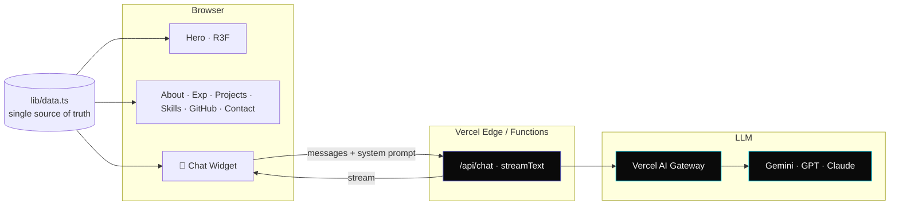

<div align="center">

<a href="#">
  
</a>

<br />

<a href="#">
  
</a>

<br /><br />

<a href="https://nextjs.org" target="_blank"></a>
<a href="https://www.typescriptlang.org" target="_blank"></a>
<a href="https://react.dev" target="_blank"></a>
<a href="https://tailwindcss.com" target="_blank"></a>
<a href="https://ui.shadcn.com" target="_blank"></a>
<a href="https://motion.dev" target="_blank"></a>
<a href="https://r3f.docs.pmnd.rs" target="_blank"></a>
<a href="https://sdk.vercel.ai" target="_blank"></a>
<a href="https://vercel.com" target="_blank"></a>

<br />

<a href="#"></a>
<a href="#"></a>
<a href="#"></a>
<a href="#"></a>
<a href="#"></a>

<br /><br />


</div>

<br />

<!-- ────────────────────────────────────────────────────────────── -->

## ✦ Overview

Single-page personal site for **Shivang Singh** — AI Engineer @ Publicis Sapient. Heavy frontend, fluid motion, 3D hero, streaming AI chatbot grounded in resume context.

> *"Best-in-class personal portfolio. Premium SaaS feel (Linear × Vercel × Raycast). Showcases AI/GenAI/LLM production work."* — design spec

<table>
<tr>
<td>

**Why this exists**

Most engineer portfolios fall into two buckets:

- 🦴 Plain markdown CV-on-the-web
- 🎪 All-3D, zero-substance demos

This one threads the needle: **production-grade frontend craft** as the proof, **production GenAI work** as the content.

</td>
<td>

**What's special**

- Resume serialized into LLM system prompt → ask the bot anything
- R3F particle hero, instanced points + cursor parallax
- Lenis smooth-scroll + Motion stagger reveals
- Magnetic CTAs, gradient-sweep project cards
- SSR-first, R3F hydrates after hero static render

</td>
</tr>
</table>

<br />

<!-- ────────────────────────────────────────────────────────────── -->

## ✦ Visual System

Tokens live in [app/globals.css](app/globals.css). Design language: **near-black canvas, electric indigo accent, cyan glow gradients.**

<div align="center">

| Token | Value | Preview |
|---|---|:---:|
| `--background` | `#050505` |  |
| `--card`       | `#0A0A0A` |  |
| `--foreground` | `#FAFAFA` |  |
| `--primary`    | `oklch(0.72 0.20 250)` electric indigo |  |
| `--glow`       | `#00D9FF` cyan |  |
| `--border`     | `zinc-800` |  |

</div>

**Type** · `Geist Sans` for display (clamp 48–120px hero), `Geist Mono` for tags, metrics, code chips.
**Density** · `gap-6`, `p-6`, `py-24` between sections.
**Radius** · `0.75rem`.

<br />

<!-- ────────────────────────────────────────────────────────────── -->

## ✦ Sections

```
┌─────────────────────────────────────────────────────────────────────┐
│  ①  HERO         · R3F particle constellation · mouse parallax     │
│  ②  ABOUT        · bio + animated stat strip (95% · 10K+ · 1K+)    │
│  ③  EXPERIENCE   · vertical timeline · expandable metric cards     │
│  ④  PROJECTS     · gradient border sweep · tech chips · GH link    │
│  ⑤  SKILLS       · chip clusters · staggered viewport reveal       │
│  ⑥  GITHUB       · contribution heatmap + featured repos           │
│  ⑦  CONTACT      · magnetic mailto · resume download               │
│  ⊕  CHATBOT      · floating pill · streams via AI SDK + Gateway    │
└─────────────────────────────────────────────────────────────────────┘
```

<br />

<!-- ────────────────────────────────────────────────────────────── -->

## ✦ Motion Language

```ts
// viewport-stagger reveals
{ delay: i * 0.06, ease: "easeOut",
  initial: { y: 20, opacity: 0 },
  whileInView: { y: 0, opacity: 1 } }
```

| System | Where | Detail |
|---|---|---|
| Stagger reveals | every section | 60ms cascade · `y:20→0` · `opacity:0→1` |
| Magnetic CTAs | hero, contact | cursor pull · max 8px |
| R3F idle | hero | slow rotation + cursor parallax |
| Lenis | global | smooth scroll + section anchor |
| Dot cursor | hero only | subtle |
| Marquee | client band | text-only logos (no fake assets) |
| Reduced motion | global | kills 3D rotation + scroll transforms |

<br />

<!-- ────────────────────────────────────────────────────────────── -->

## ✦ Tech Stack

<div align="center">

<table>
<tr>
<td valign="top" width="33%">

### 🎨 Frontend
- **Next.js 16** App Router · RSC · Turbopack
- **TypeScript** strict
- **Tailwind v4** `@theme inline`
- **shadcn/ui** new-york · zinc
- **Geist Sans + Mono**

</td>
<td valign="top" width="33%">

### 🌀 Motion + 3D
- **Motion** (`motion/react`)
- **React Three Fiber** instanced points
- **@react-three/drei**
- **Lenis** smooth scroll
- **`prefers-reduced-motion`** aware

</td>
<td valign="top" width="33%">

### 🤖 AI Layer
- **AI SDK v5** `streamText`
- **Vercel AI Gateway**
- **shadcn ai-elements** chat sheet
- **RAG-lite** resume → system prompt
- **Sonner** toasts

</td>
</tr>
</table>

</div>

<br />

<!-- ────────────────────────────────────────────────────────────── -->

## ✦ Architecture



<sub><b>Single source of truth.</b> [lib/data.ts](lib/data.ts) types & exports `profile`, `stats`, `experiences`, `projects`, `skills`, `certifications`, `education`, `navLinks`. Every section + the chatbot system prompt reads from here. No CMS.</sub>

<br />

<!-- ────────────────────────────────────────────────────────────── -->

## ✦ File Layout

```
shivang-portfolio/
├─ app/
│  ├─ layout.tsx              ▸ fonts · theme · Lenis · Toaster
│  ├─ globals.css             ▸ design tokens · @theme inline
│  ├─ page.tsx                ▸ composes sections
│  └─ api/chat/route.ts       ▸ AI SDK streamText
├─ components/
│  ├─ nav.tsx                 ▸ sticky anchor nav + progress
│  ├─ sections/
│  │  ├─ hero.tsx             ▸ name · role · CTAs
│  │  ├─ about.tsx            ▸ bio + stat strip
│  │  ├─ experience.tsx       ▸ timeline cards
│  │  ├─ projects.tsx         ▸ 4 featured projects
│  │  └─ skills.tsx           ▸ chip clusters
│  ├─ hero/particles-3d.tsx   ▸ R3F scene (lazy)
│  ├─ effects/cursor.tsx      ▸ dot cursor
│  ├─ motion/
│  │  ├─ magnetic.tsx         ▸ cursor-pull wrapper
│  │  └─ reveal.tsx           ▸ viewport stagger
│  └─ providers/lenis-provider.tsx
├─ lib/
│  ├─ data.ts                 ▸ resume · projects · skills (typed)
│  ├─ resume-context.ts       ▸ system-prompt builder
│  └─ utils.ts                ▸ cn helper
├─ docs/superpowers/specs/    ▸ design spec
└─ public/resume.pdf
```

<br />

<!-- ────────────────────────────────────────────────────────────── -->

## ✦ Quick Start

```bash
# 1. Install
pnpm install

# 2. Env (chatbot)
echo 'AI_GATEWAY_API_KEY=...' > .env.local

# 3. Dev (Turbopack)
pnpm dev          # → http://localhost:3000

# 4. Type check
pnpm typecheck

# 5. Build + start
pnpm build && pnpm start
```

<details>
<summary><b>Available scripts</b></summary>

| Script | What it does |
|---|---|
| `pnpm dev` | Next.js dev server with **Turbopack** |
| `pnpm build` | Production build |
| `pnpm start` | Serve built app |
| `pnpm lint` | ESLint (next/core-web-vitals) |
| `pnpm typecheck` | `tsc --noEmit` strict pass |

</details>

<br />

<!-- ────────────────────────────────────────────────────────────── -->

## ✦ Performance Budget

<div align="center">

| Metric | Budget | Strategy |
|:---|:---:|:---|
| **LCP** | `< 1.5s` on 4G | Static hero shell, R3F lazy-imports after first paint |
| **INP** | `< 100ms` | No JS on first paint outside nav; hydrate-on-idle |
| **Initial JS** | `< 200KB` | 3D scene + chat widget code-split |
| **CLS** | `~ 0` | Reserved heights for hero canvas & cards |

</div>

<br />

<!-- ────────────────────────────────────────────────────────────── -->

## ✦ Accessibility

- Semantic landmarks, `h1 → h6` order enforced
- All interactives keyboard-reachable
- Focus ring uses `--primary`
- `prefers-reduced-motion`: kills 3D rotation + scroll transforms
- AAA contrast on body text

<br />

<!-- ────────────────────────────────────────────────────────────── -->

## ✦ Featured Projects (data-driven)

Pulled from [lib/data.ts](lib/data.ts#L106) — single edit, every UI follows.

<table>
<tr>
<td width="50%" valign="top">

#### 🛰️ Dossier
*Autonomous Agentic Job Search Intelligence*

7-agent autonomous pipeline · Parallel LLM scoring across 550+ jobs · Pre-LLM filters cut **65%** of API calls · Claude generates ATS-optimised LaTeX resumes via 3-pass self-eval.

`GPT-5` `Claude Sonnet 4.6` `Claude Haiku 4.5` `Tavily` `LaTeX`

**`$0.06`** per application

</td>
<td width="50%" valign="top">

#### 🔬 FedFV-CV
*Federated DL for Biometric Auth*

Federated learning framework for finger-vein auth. Custom **FedWPR** aggregation on 122,600 images across 5 clients, outperforming FedAvg.

`PyTorch` `MobileNetV2` `Federated Learning`

**`1.21%`** EER · B.Tech Thesis

</td>
</tr>
<tr>
<td width="50%" valign="top">

#### 💬 slackAgent
*AI-Powered Slack Bot with RAG*

FastAPI + LlamaIndex + ChromaDB semantic search over 20+ docs. n8n end-to-end automation.

`FastAPI` `LlamaIndex` `ChromaDB` `OpenAI` `n8n`

**`40%`** response time cut

</td>
<td width="50%" valign="top">

#### ☁️ RAG-QA on AWS
*Retrieval-Augmented QA, fully CI/CD*

LangChain + FAISS + AWS Bedrock (LLAMA 3.1-70B). AWS ECR + App Runner via Docker + GitHub Actions.

`LangChain` `FAISS` `AWS Bedrock` `Docker` `GH Actions`

**`70B`** params served

</td>
</tr>
</table>

<br />

<!-- ────────────────────────────────────────────────────────────── -->

## ✦ Roadmap

| Status | Item |
|:---:|---|
| ✅ | Hero · About · Experience · Projects · Skills · Contact |
| ✅ | R3F particle scene · Lenis · Motion reveals |
| ✅ | Resume system-prompt scaffolding |
| 🟡 | AI Gateway key wired + chatbot live |
| 🟡 | GitHub heatmap section |
| ⬜ | Blog *(out of v1 scope)* |
| ⬜ | Light theme toggle *(out of v1 scope)* |
| ⬜ | i18n · CMS *(out of v1 scope)* |

<br />

<!-- ────────────────────────────────────────────────────────────── -->

## ✦ Credits

Built by **Shivang Singh** · AI Engineer @ Publicis Sapient · Bengaluru

Design language inspired by [Linear](https://linear.app), [Vercel](https://vercel.com), [Raycast](https://raycast.com).
Specs live in [docs/superpowers/specs/2026-05-22-portfolio-design.md](docs/superpowers/specs/2026-05-22-portfolio-design.md).

<br />

<div align="center">

<a href="https://github.com/shivangsingh26"></a>
<a href="https://linkedin.com/in/shivangsingh26"></a>
<a href="mailto:ssnfs26@gmail.com"></a>

<br /><br />


</div>
