<a name="readme-top"></a>

> **Repo layout (post-M3 — May 2026):**
> - [`sdk/`](sdk/) — installable Python SDK (`dossier-sdk`). All agents, core utilities, prompts, config, `orchestrator.run_pipeline`.
> - [`backend/`](backend/) — FastAPI service (`dossier-api`) on `:8000`. Clerk auth, accounts/credits, persona wizard, pipeline runner, SSE progress, async worker.
> - [`frontend/`](frontend/) — Next.js 16 (App Router, React 19, Tailwind v4, shadcn/ui). Marketing site, Clerk sign-in, onboarding wizard, dashboard, jobs inbox.
> - [`dashboard.py`](dashboard.py) — Legacy Streamlit job tracker. Retires after M4 ships.
> - [`data/`](data/), [`profile/`](profile/) — Per-user pipeline data + persona files (gitignored).
> - [`scripts/`](scripts/) — Thin CLI wrappers importing from `dossier_sdk`.
> - [`docs/superpowers/specs/`](docs/superpowers/specs/), [`docs/superpowers/milestones/`](docs/superpowers/milestones/) — Design specs + per-milestone plans (M0–M11).
> - [`frontend-todo.txt`](frontend-todo.txt) — Live aggregated task tracker.
> - **📘 [`docs/PRODUCT.md`](docs/PRODUCT.md) — full product documentation** (architecture, SDK reference, agent reference, HTTP API, data model, deployment, end-user guide, contributing).
>
> **Run pipeline (CLI):** `uv run python run_dossier.py --user shivang --mode quick`
> **Run web stack:** `uv run uvicorn dossier_api.main:app --reload --port 8000` (backend) + `pnpm dev` (frontend) + `uv run python -m dossier_api.workers.pipeline_worker` (worker)
> **Run legacy dashboard:** `streamlit run dashboard.py`

<!-- ============================================================ -->
<!--  Animated gradient banner (capsule-render — renders as SVG)  -->
<!-- ============================================================ -->

<p align="center">
  <a href="#readme-top">
    
  </a>
</p>

<div align="center">

<!-- Animated typing tagline -->
<a href="#readme-top">
  
</a>

<br/><br/>

<!-- Tech-stack icon row (devicons via skillicons.dev) -->
<a href="#-saas-stack">
  
</a>

<br/><br/>

<!-- Tech-stack badges -->
[](https://www.python.org/)
[](https://docs.astral.sh/uv/)
[](https://nextjs.org/)
[](https://fastapi.tiangolo.com/)
[](https://clerk.com/)
[](https://platform.openai.com/)
[](https://anthropic.com/)
[](LICENSE)

<br/>

<!-- Live stats -->
[]()
[]()
[]()
[]()
[]()

<br/>

[Why Dossier](#-why-not-just-use-a-job-board) · [What's inside](#-whats-inside) · [Quick start](#-quick-start) · [How it works](#-how-it-works) · [SaaS stack](#-saas-stack) · [Roadmap](#-roadmap)

<br/>

> **Dossier is not a job board wrapper or a resume template tool.**
> It is a quality-first agentic pipeline that finds, scores, researches, and surfaces
> the roles most worth your time — wrapped in a multi-user SaaS so anyone can onboard
> and run their own pipeline from a browser.

<br/>

<!-- Gradient divider -->


</div>

---

## ✦ Why not just use a job board?

Job boards give you *more*. Dossier gives you *signal*.

<br/>

<table>
<thead>
<tr>
<th align="left"></th>
<th align="center">Job boards</th>
<th align="center">Mass-apply bots</th>
<th align="center" bgcolor="#0d2137"><strong>✦ Dossier</strong></th>
</tr>
</thead>
<tbody>
<tr>
<td>Finds roles at <em>your</em> target companies</td>
<td align="center">sometimes</td>
<td align="center">✗</td>
<td align="center" bgcolor="#0d2137"><strong>✓</strong></td>
</tr>
<tr>
<td>Scores against <em>your specific</em> profile</td>
<td align="center">✗</td>
<td align="center">✗</td>
<td align="center" bgcolor="#0d2137"><strong>✓</strong></td>
</tr>
<tr>
<td>Eliminates 60% of noise before spending anything</td>
<td align="center">✗</td>
<td align="center">✗</td>
<td align="center" bgcolor="#0d2137"><strong>✓</strong></td>
</tr>
<tr>
<td>Researches the company before you click apply</td>
<td align="center">✗</td>
<td align="center">✗</td>
<td align="center" bgcolor="#0d2137"><strong>✓</strong></td>
</tr>
<tr>
<td>Tells you which skills you're actually missing</td>
<td align="center">✗</td>
<td align="center">✗</td>
<td align="center" bgcolor="#0d2137"><strong>✓</strong></td>
</tr>
<tr>
<td>Finds promoted listings keyword search never sees</td>
<td align="center">✗</td>
<td align="center">✗</td>
<td align="center" bgcolor="#0d2137"><strong>✓</strong></td>
</tr>
<tr>
<td>Adapts to ML, SDE, or Data roles per user</td>
<td align="center">✗</td>
<td align="center">✗</td>
<td align="center" bgcolor="#0d2137"><strong>✓</strong></td>
</tr>
<tr>
<td>Cost per week of daily runs</td>
<td align="center">$0</td>
<td align="center">$20–50/mo</td>
<td align="center" bgcolor="#0d2137"><strong>~$0.30</strong></td>
</tr>
<tr>
<td>Applications sent</td>
<td align="center">high volume</td>
<td align="center">very high</td>
<td align="center" bgcolor="#0d2137"><strong>fewer, better</strong></td>
</tr>
</tbody>
</table>

<br/>

The average ML/AI engineer sends 80+ applications and gets 5 responses. Dossier is built on the opposite thesis: send 10 targeted applications with full context on each company, and get 5 responses.

<br/>

<div align="center">

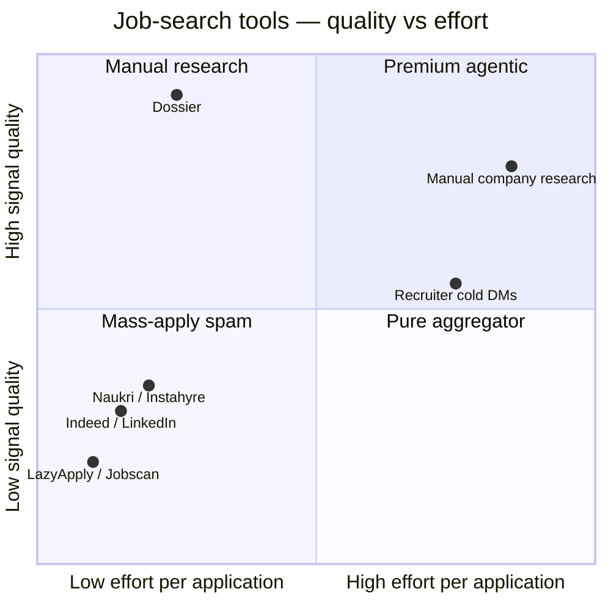

</div>

<p align="right">(<a href="#readme-top">back to top</a>)</p>

---

## ✦ What's inside

Eight agents working together. Each is independently useful. All live in `sdk/dossier_sdk/agents/` and are domain-aware — the same agent serves ML/AI, SDE, and Data Science profiles based on `profile.json:role_domain`.

<br/>

<!-- At-a-glance stat strip -->
<div align="center">

|  |  |  |  |  |  |
|:---:|:---:|:---:|:---:|:---:|:---:|

</div>

<br/>

<table>
<tr>
<td width="50%" valign="top" bgcolor="#0d1a2e">


### 🔍 Job Discovery
Multi-source keyword search across **Indeed + LinkedIn** using profile-driven `target.search_terms`. A rule-based pre-filter eliminates ~60% of results before spending a single LLM token. Survivors are parallel-scored in ~2 minutes against the user's `role_domain` (ml_ai / sde / data).

```
~550 raw  ──pre-filter──▶  ~220 scored  ──LLM──▶  ~57 ranked
                                                    ┗ ~31 high relevancy
```

 &nbsp; &nbsp;

</td>
<td width="50%" valign="top" bgcolor="#130c26">


### 🎯 Watchlist Agent
Company-specific search across **79 hand-picked companies** using LinkedIn `f_C=` filters, Greenhouse, and Lever free JSON APIs. Each company carries a `target_domains` tag — SDE users see Cisco/Nutanix/Rubrik, ML users see Sarvam/Krutrim/Haptik, both see MAANG. Catches promoted listings that keyword search never surfaces.

```
79 companies  ──domain filter──▶  N relevant  ──per-company──▶  ~40 raw  ──LLM──▶  ~10 scored
```

 &nbsp; &nbsp;

</td>
</tr>
<tr>
<td width="50%" valign="top" bgcolor="#1a1400">


### 🏢 Company Intel
For every job scoring ≥ 7/10: one command replaces 30 minutes of Googling. Funding stage, headcount estimate, ML focus, risk flags, recent news — synthesised from Tavily + Wikipedia into a structured JSON artifact. 7-day cache keeps costs near zero.

```
score ≥ 7  ──Tavily (×2)──▶  raw snippets
           ──Wikipedia──▶    context
           ──GPT-5.4-mini──▶  intel.json
```

 &nbsp; &nbsp;

</td>
<td width="50%" valign="top" bgcolor="#08180a">


### 📊 Gap Analysis
Semantic skill extraction across all accumulated JDs. Not keyword matching — the LLM reads your full profile and reasons about capability equivalence. Tells you exactly what the market wants that you don't claim yet.

```
193 JDs  ──LLM (×8)──▶  6-category extraction
         ──semantic──▶   has / missing split
         ──aggregate──▶  gap_report.json
```

 &nbsp; &nbsp;

</td>
</tr>
</table>

<br/>

<details>
<summary><strong>+ 4 more agents in the pipeline</strong></summary>

<br/>

<table>
<thead>
<tr><th align="left">Agent</th><th align="left">What it does</th><th align="center">Status</th></tr>
</thead>
<tbody>
<tr>
<td><strong>Persona Builder</strong></td>
<td>Resume + LinkedIn PDF parse → questionnaire → 13-question conversational quiz → LLM synthesis into <code>profile.json</code> (schema v2: <code>full_time_months</code>, <code>intern_months</code>, <code>certifications</code>, <code>publications</code>, <code>key_projects</code>, <code>preferred_work_style</code>, <code>relocation_cities</code>). Runs CLI or via the M3 web wizard.</td>
<td align="center" bgcolor="#0a1e0a"></td>
</tr>
<tr>
<td><strong>Market Intel</strong></td>
<td>Monitors YourStory / Inc42 / TechCrunch for new AI/ML funding rounds. Routes companies to watchlist or cold outreach</td>
<td align="center" bgcolor="#0a1e0a"></td>
</tr>
<tr>
<td><strong>Resume Agent</strong></td>
<td>3-pass self-evaluation: Sonnet tailor → Haiku critic → Sonnet revise. Hallucination guard + ATS keyword mirroring enforced. ~$0.08–0.14/application</td>
<td align="center" bgcolor="#0a1e0a"></td>
</tr>
<tr>
<td><strong>Referral Finder</strong></td>
<td>3-tier contact search: warm LinkedIn connections → cold Tavily search → personalised LLM cold message per contact. Confidence-scored, seniority-aware</td>
<td align="center" bgcolor="#0a1e0a"></td>
</tr>
</tbody>
</table>

</details>

<p align="right">(<a href="#readme-top">back to top</a>)</p>

---

## ✦ Quick start

<!-- Carbon-style terminal preview (rendered as SVG via Ray.so / Carbon image cache) -->
<div align="center">

```console
$ uv run python run_dossier.py --user shivang --mode quick

╭──────────────────────────────────────────────────────────────╮
│  Dossier · daily pipeline                                    │
├──────────────────────────────────────────────────────────────┤
│  user           shivang  ml_ai                               │
│  search terms   10  (Machine Learning Engineer, LLM ...)     │
│  raw jobs       552                                          │
│  pre-filter     dropped 331  (60.0 %)                        │
│  LLM scored     221  (8 workers · 1m 47s · $0.041)           │
│  ranked         57   (≥ 5/10)                                │
│  high signal    31   (≥ 7/10)                                │
│                                                              │
│  watchlist      79 companies · 11 matched · 6 ≥ 5            │
│  intel cached   54  · fetched  9  ($0.018)                   │
│  artifacts      data/shivang/artifacts/                      │
╰──────────────────────────────────────────────────────────────╯

✓ pipeline complete · 4m 12s · $0.059 total
```

</div>

**Prerequisites:** Python 3.12+, [uv](https://docs.astral.sh/uv/), Node 20+ with pnpm (only if running the web stack), OpenAI + Anthropic API keys.

### Path A — CLI only (existing flow)

```bash
# 1 · Clone and install the SDK
git clone https://github.com/shivangsingh26/dossier.git
cd dossier && uv sync

# 2 · Add API keys
cp .env.example .env
#   → open .env, add OPENAI_API_KEY and ANTHROPIC_API_KEY

# 3 · Build your profile (one-time, ~5 min)
uv run python scripts/run_persona_builder.py --user shivang

# 4 · Run the full daily pipeline
uv run python run_dossier.py --user shivang --mode quick
```

### Path B — Full SaaS stack (M2+ web app)

```bash
# Backend (FastAPI :8000)
cd backend && uv sync && cp .env.example .env       # fill Clerk keys
uv run uvicorn dossier_api.main:app --reload --port 8000

# Worker (separate terminal — picks up queued pipeline runs)
cd backend && uv run python -m dossier_api.workers.pipeline_worker

# Frontend (Next.js :3000)
cd frontend && pnpm install && pnpm dev
```

That's it. Sign up via Clerk → walk through the onboarding wizard (upload resume + LinkedIn PDF, fill questionnaire, answer quiz, review) → land in the dashboard.

<br/>

<details>
<summary><strong>Run agents individually via CLI</strong></summary>

<br/>

```bash
# Keyword discovery — last 10 days, all scores
uv run python scripts/run_job_discovery.py --user shivang --hours 240

# High-relevancy only — last 3 days
uv run python scripts/run_job_discovery.py --user shivang --hours 72 --min-score 7

# Watchlist — domain-filtered companies for the user
uv run python scripts/run_watchlist.py --user shivang --min-score 5

# Company intel — research jobs you're interested in
uv run python scripts/run_company_intel.py --user shivang --min-score 7 --source both

# Gap analysis — run once, then incrementally
uv run python scripts/run_gap_analysis.py --user shivang --top 15

# Market intel — run weekly
uv run python scripts/run_market_intel.py --user shivang

# Referral finder
uv run python scripts/run_referral_finder.py --user shivang --list
uv run python scripts/run_referral_finder.py --user shivang --job-id <job_id>

# Resume + cover letter (3-pass self-evaluation)
uv run python scripts/run_resume_agent.py --user shivang --list
uv run python scripts/run_resume_agent.py --user shivang --job-id <job_id>

# Onboard a new user — fillable questionnaire
uv run python scripts/export_questionnaire.py --user <name>

# Verify all LLM providers
uv run python tests/test_llm_client.py
```

</details>

<p align="right">(<a href="#readme-top">back to top</a>)</p>

---

## ✦ How it works

<div align="center">

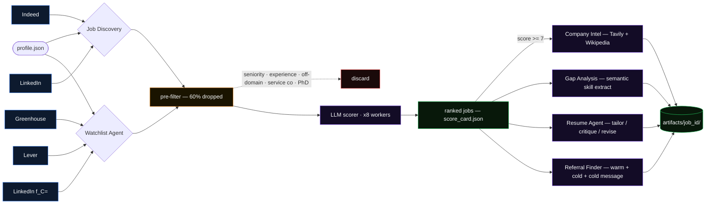

</div>

<br/>

<details>
<summary><strong>Pre-filter logic — zero LLM spend</strong></summary>

<br/>

Every job passes through these gates **before** reaching the LLM. Order matters — each gate is cheaper than the next.

```
is_hard_no()              ← service cos (TCS · Infosys · NTT DATA · Happiest Minds...)
                            IT staffing, job aggregators
description < 100 chars   ← no content = no signal
is_seniority_mismatch()   ← profile-driven: Senior · Staff · VP · Intern · Apprenticeship
classify_job_function()   ← domain-aware: ML/DS titles → off_domain for SDE users (0 pts)
                            SDE/backend titles → off_domain for ML users
                            support_ops (SRE / DevOps / pure Infra) → cap at 3
extract_years_required()  ← > exp_band max → hard reject (no LLM wasted)
extract_degree_required() ← PhD → hard reject · Masters → soft penalty note to LLM
is_job_seen(url)          ← per-user SQLite dedup · already scored → skip
```

~60% of raw jobs are eliminated here. The LLM only sees candidates worth scoring.

</details>

<br/>

<details>
<summary><strong>Domain-aware scoring — same agent, three personas</strong></summary>

<br/>

`build_scoring_system_prompt` is generic. It reads `target.roles` and `role_domain` from the user's profile and assembles a domain-specific prompt at runtime. The same `score_job` function serves:

| Profile | `role_domain` | Targeted titles | Off-domain titles |
|---|---|---|---|
| Shivang, Krishna | `ml_ai` | ML Engineer, AI Engineer, Data Scientist, LLM Engineer | SDE, Backend, Frontend |
| Anushthan | `sde` | Backend Engineer, SDE-1, Software Engineer | ML Engineer, Data Scientist |
| (future) | `data` | Analytics Engineer, Data Engineer, BI | ML Engineer, SDE |

Experience derives from `full_time_months` (with `intern_months` fallback). `switch_months` computes from `target.target_by` — no hardcoded countdown.

</details>

<br/>

<details>
<summary><strong>Semantic gap analysis — how the matching works</strong></summary>

<br/>

The gap agent doesn't keyword-match. It sends your full profile summary alongside every JD and asks the LLM to reason about capability equivalence.

```
JD says "PyTorch"
  + profile has "Computer Vision [can_architect]: YOLO, RF-DETR, MobileNetV2, Deep Learning"
  → candidate HAS PyTorch  ✓  (domain at architect depth implies the core framework)

JD says "RAG"
  + profile has "RAG Systems [can_architect]: LlamaIndex, LangChain, ChromaDB, FAISS"
  → candidate HAS RAG  ✓  (exact alias match)

JD says "SQL"
  + profile has no SQL alias anywhere
  → candidate MISSING SQL  ✗  (never inferred from Python/ML background alone)
```

Six categories per JD: `technical` · `tools_platforms` · `domain` · `research_methods` · `behavioral` · `certifications`

Each job gets a `gap.json` (schema v2) with `candidate_has_required` and `candidate_missing_required` lists. The resume agent reads these to decide which bullets to lead with.

**Current market signal (193 JDs):**

| Required gap | % of JDs | | Strong match | % of JDs |
|---|---|---|---|---|
| SQL | 42% | | Python | 79% |
| Cross-functional Collaboration | 38% | | AWS | 37% |
| NLP (domain) | 24% | | RAG | 27% |
| TensorFlow | 22% | | GCP | 21% |
| Java | 16% | | | |

</details>

<br/>

<details>
<summary><strong>Watchlist — why company-specific beats keyword search</strong></summary>

<br/>

Keyword search returns jobs that LinkedIn and Indeed want to show you. Company-specific `f_C=` search returns **every current opening** at that company, including promoted listings, internal transfers, and roles posted without common ML keywords.

```
Greenhouse API    boards-api.greenhouse.io/v1/boards/{token}/jobs   (free JSON, clean data)
Lever API         api.lever.co/v0/postings/{handle}?mode=json        (free JSON)
LinkedIn f_C=     company-specific search with numeric ID filter

LinkedIn ID resolver:
  slug → multi-pattern HTML extraction → numeric company ID
       → cache: data/linkedin_company_ids.json  (auto-grows, 45+ entries)
       → fallback: /about/ page if main page fails
```

The scraper uses `requests.Session()` for TCP reuse, exponential backoff on 429 (`30s → 60s → 120s`), ±40% jitter on all sleeps, and parallel description fetching with slot-based stagger — so LinkedIn doesn't see a burst pattern.

</details>

<br/>

<details>
<summary><strong>Resume agent — 3-pass self-evaluation loop</strong></summary>

<br/>

The resume agent runs three sequential LLM passes. Each pass has a distinct prompt file in `sdk/dossier_sdk/prompts/`. Output of pass N feeds pass N+1. The critic can re-trigger the revise step if any of its 4 audits fail.

<div align="center">

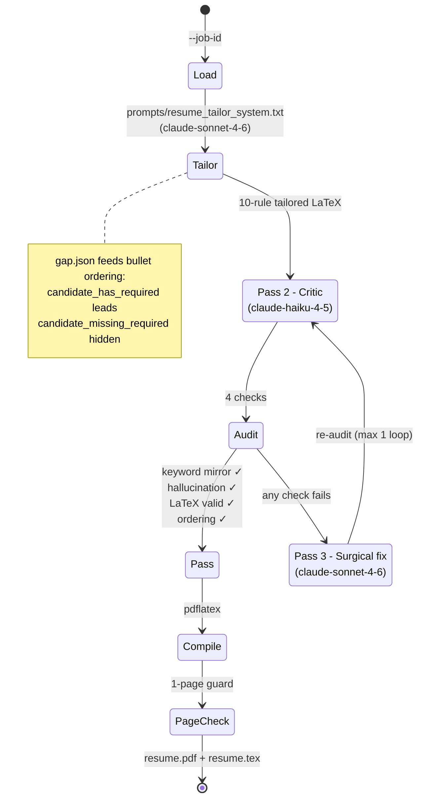

</div>

Cost per application: ~$0.08–0.14 (depends on whether revise pass fires). Output: `data/{user}/artifacts/{job_id}/resume.tex` + `resume.pdf` + `cover_letter.txt`.

</details>

<br/>

<details>
<summary><strong>Job funnel — where the 552 raw jobs go (sankey)</strong></summary>

<br/>

<div align="center">

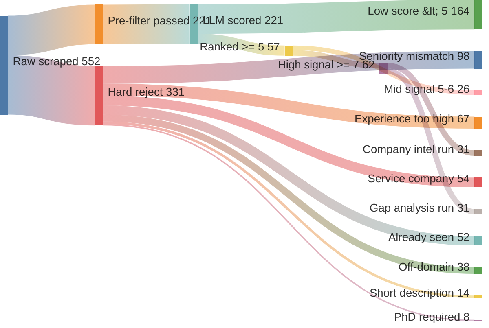

<sub>Numbers from <code>data/shivang/last_pipeline_run.json</code> on a representative 552-job daily run.</sub>

</div>

</details>

<p align="right">(<a href="#readme-top">back to top</a>)</p>

---

## ✦ SaaS stack

Built across **M0–M4** to wrap the existing CLI pipeline in a full multi-user web product.

<br/>

<table>
<thead><tr><th align="left">Layer</th><th align="left">Stack</th><th align="left">What lives here</th></tr></thead>
<tbody>
<tr>
<td><strong>SDK</strong> <code>sdk/dossier_sdk</code></td>
<td>Python 3.12, OpenAI, Anthropic, JobSpy, gspread, rich</td>
<td>All 8 agents · <code>orchestrator.run_pipeline</code> · LLM client · per-user SQLite (<code>data/{user}/dossier.db</code>) · Tavily cache · LinkedIn resolver · file vault</td>
</tr>
<tr>
<td><strong>Backend</strong> <code>backend/src/dossier_api</code></td>
<td>FastAPI 0.136 · Pydantic 2 · Clerk (<code>clerk-backend-api</code>) · Svix · <code>sse-starlette</code> · <code>fasteners</code></td>
<td>Routers: <code>/health</code>, <code>/me</code>, <code>/webhooks/clerk</code>, <code>/persona/*</code>, <code>/pipeline/*</code>, <code>/jobs/*</code> · <code>accounts.db</code> (accounts, credits, runs, waitlist) · async worker polling <code>pipeline_runs</code> · credit gate (atomic deduct + refund on failure) · SSE progress stream</td>
</tr>
<tr>
<td><strong>Frontend</strong> <code>frontend/app</code></td>
<td>Next.js 16 (App Router, Turbopack) · React 19 · TypeScript strict · Tailwind v4 · shadcn/ui (radix-nova) · Clerk · TanStack Query · react-hook-form · zod · motion · Vitest</td>
<td>Marketing (hero, terminal-log, agents grid, pricing) · Clerk sign-in/sign-up · Onboarding wizard (upload → targets → quiz → review → synthesis) · Dashboard shell · Pending review state · Jobs inbox (M4 wip)</td>
</tr>
<tr>
<td><strong>Worker</strong> <code>backend/.../workers</code></td>
<td>Long-running Python process</td>
<td>Atomic <code>pick_next_queued_run</code> · dispatch table: <code>persona_synthesis</code> (M3) → <code>discovery</code> (M4) · refund-on-failure semantics</td>
</tr>
</tbody>
</table>

<br/>

<div align="center">

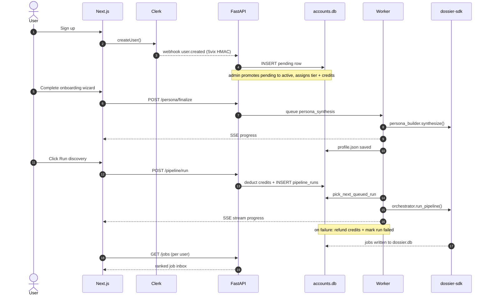

</div>

<br/>

**Auth model.** Clerk owns user identity. `user.created` webhook provisions a `pending` row in `accounts.db`. An admin promotes pending → active and assigns tier + credits. `GET /me` returns 200/401/403/suspended/pending based on state.

**Credits model.** Each pipeline action has a cost and a min-tier gate. `POST /pipeline/run` atomically deducts credits + INSERTs `pipeline_runs`; the worker picks it up, streams progress over SSE, refunds idempotently on failure (keyed on `(run_id, reason)` so retries are safe).

**Agent cost matrix** (from `backend/src/dossier_api/routers/pipeline.py:AGENTS`)

| Agent | Cost (credits) | Min tier | Est. runtime | Worker handler |
|---|---:|:---:|---:|---|
| `discovery` | 5 |  | 2m | ✅ M4 wired |
| `watchlist` | 8 |  | 4m | stub |
| `company_intel` | 3 |  | 3m | stub |
| `gap_analysis` | 4 |  | 1m | stub |
| `resume_tailor` | 12 |  | 90s | stub |
| `cover_letter` | 4 |  | 45s | stub |
| `referral_finder` | 6 |  | 2m | stub |
| `market_intel` | 5 |  | 90s | stub |
| `persona_synthesis` | 0 | — | 60s | ✅ M3 wired |

New accounts get **100 credits** on signup, **reset every 30 days**. Stripe/Razorpay integration is **M11** and deferred until ≥20 Pro waitlist signups validate paying intent. Today the "Upgrade" button drops users into a `waitlist` row.

<br/>

**`accounts.db` schema** (real ER diagram from `backend/src/dossier_api/db.py`)

<div align="center">

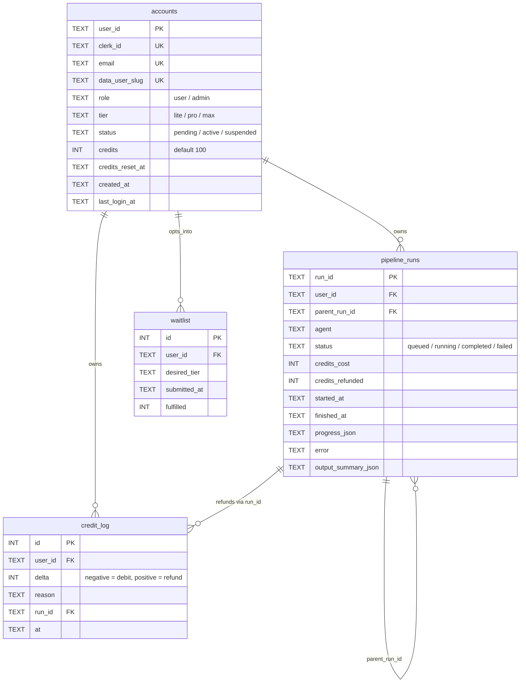

</div>

<br/>

**Account + pipeline-run lifecycles** (from `routers/me.py` + `workers/pipeline_worker.py`)

<div align="center">

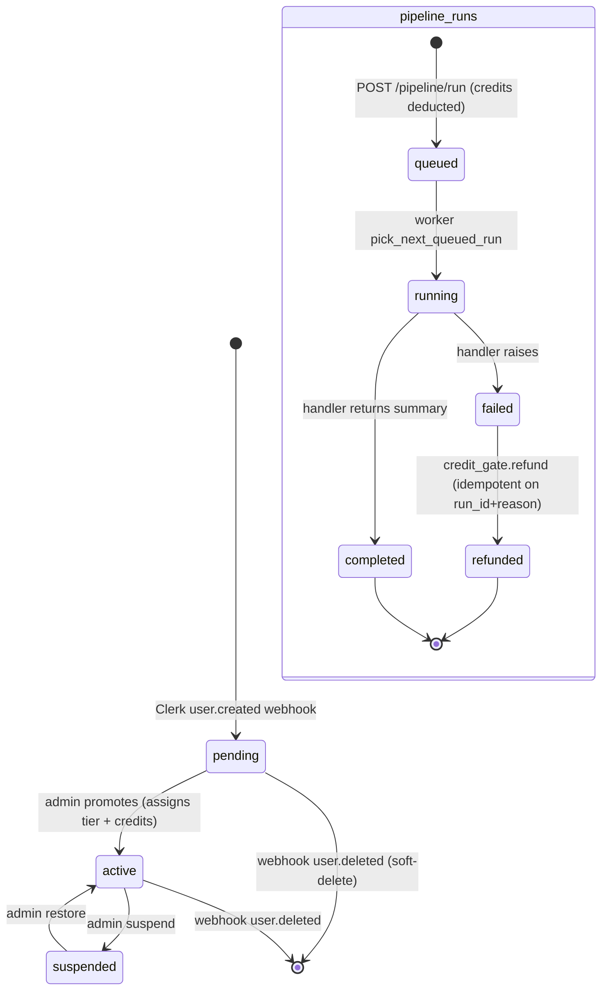

</div>

<p align="right">(<a href="#readme-top">back to top</a>)</p>

---

## ✦ API surface

Every route mounted by `backend/src/dossier_api/main.py`, grouped by router. All routes (except `/health` and `/webhooks/*`) require a Clerk session token in `Authorization: Bearer <jwt>` and resolve `get_current_user` → 401/403/suspended/pending.

<br/>

<table>
<thead>
<tr><th align="left">Router</th><th align="left">Method · Path</th><th align="left">Purpose</th><th align="center">Auth</th></tr>
</thead>
<tbody>
<tr><td><strong>health</strong></td><td><code>GET&nbsp;/health</code></td><td>Liveness probe</td><td align="center">—</td></tr>
<tr><td rowspan="2"><strong>me</strong></td><td><code>GET&nbsp;/me</code></td><td>Current account: tier, credits, status</td><td align="center">🔒</td></tr>
<tr><td><em>200 / 401 / 403 / pending / suspended</em></td><td>Drives the app-shell branching in <code>(app)/layout.tsx</code></td><td align="center"></td></tr>
<tr><td><strong>webhooks</strong></td><td><code>POST&nbsp;/webhooks/clerk</code></td><td>Svix HMAC verify → provisions / soft-deletes accounts</td><td align="center">Svix</td></tr>
<tr><td rowspan="8"><strong>persona</strong></td><td><code>GET&nbsp;/persona</code></td><td>Read user's profile.json</td><td align="center">🔒</td></tr>
<tr><td><code>PATCH&nbsp;/persona</code></td><td>Deep-merge partial updates</td><td align="center">🔒</td></tr>
<tr><td><code>POST&nbsp;/persona/upload-pdf</code></td><td>Multipart resume / linkedin PDF (10 MB cap)</td><td align="center">🔒</td></tr>
<tr><td><code>POST&nbsp;/persona/questionnaire</code></td><td>Submit structured-fields step</td><td align="center">🔒</td></tr>
<tr><td><code>GET&nbsp;/persona/quiz-questions</code></td><td>13 hardcoded SDK questions</td><td align="center">🔒</td></tr>
<tr><td><code>POST&nbsp;/persona/quiz-answers</code></td><td>Chat-style answers</td><td align="center">🔒</td></tr>
<tr><td><code>GET&nbsp;/persona/state</code></td><td>Wizard step pointer (upload / targets / quiz / review / synth)</td><td align="center">🔒</td></tr>
<tr><td><code>POST&nbsp;/persona/finalize</code> <em>202</em></td><td>Queues <code>persona_synthesis</code> on worker</td><td align="center">🔒</td></tr>
<tr><td rowspan="4"><strong>pipeline</strong></td><td><code>POST&nbsp;/pipeline/run</code> <em>202</em></td><td>Atomic deduct credits + INSERT pipeline_runs</td><td align="center">🔒 💰</td></tr>
<tr><td><code>GET&nbsp;/pipeline/runs</code></td><td>List user's runs</td><td align="center">🔒</td></tr>
<tr><td><code>GET&nbsp;/pipeline/runs/&#123;run_id&#125;</code></td><td>Run detail (status, summary, error)</td><td align="center">🔒</td></tr>
<tr><td><code>GET&nbsp;/pipeline/runs/&#123;run_id&#125;/stream</code></td><td><strong>SSE</strong> — progress / complete / error / timeout events</td><td align="center">🔒</td></tr>
<tr><td rowspan="4"><strong>jobs</strong></td><td><code>GET&nbsp;/jobs</code></td><td>Ranked inbox over per-user <code>dossier.db</code></td><td align="center">🔒</td></tr>
<tr><td><code>GET&nbsp;/jobs/&#123;job_id&#125;</code></td><td>Full detail + score card + JD</td><td align="center">🔒</td></tr>
<tr><td><code>POST&nbsp;/jobs/&#123;job_id&#125;/status</code></td><td>Inline status edit (interested / applied / skipped / rejected)</td><td align="center">🔒</td></tr>
<tr><td><code>POST&nbsp;/jobs/&#123;job_id&#125;/notes</code></td><td>Inline notes</td><td align="center">🔒</td></tr>
</tbody>
</table>

<sub>🔒 = Clerk JWT required · 💰 = credit-gated · Svix = HMAC-signed webhook</sub>

<br/>

**SSE event types** emitted by `GET /pipeline/runs/{run_id}/stream` (from `routers/pipeline.py:212+`):

```typescript
// frontend/lib/api/pipeline.ts consumes these via the EventSource API
type RunEvent =
  | { event: 'progress'; data: { run_id: string; status: 'queued' | 'running'; progress?: any } }
  | { event: 'complete'; data: { run_id: string; status: 'completed' | 'failed'; summary?: any; error?: string } }
  | { event: 'error';    data: { detail: 'vanished' } }                  // run row deleted mid-stream
  | { event: 'timeout';  data: { run_id: string } }                      // 5 min wall-clock cap
```

<br/>

**Worker dispatch table** (`backend/src/dossier_api/workers/pipeline_worker.py:161`):

```python
_HANDLERS = {
    "persona_synthesis": _run_persona_synthesis,   # M3 ✓
    "discovery":         _run_discovery,           # M4 ✓
    # next: watchlist, company_intel, gap_analysis, resume_tailor,
    #       cover_letter, referral_finder, market_intel  (M5–M10)
}
# Unknown agent → mark failed + refund:unknown_agent (idempotent)
# Parent rows (agent="parent") → mark completed-on-pick to avoid loop
```

<p align="right">(<a href="#readme-top">back to top</a>)</p>

---

## ✦ Company coverage

79 companies across five tiers, all with verified LinkedIn slugs, ATS types, and `target_domains` tags so the watchlist only fetches what's relevant to each user.

<br/>

<div align="center">

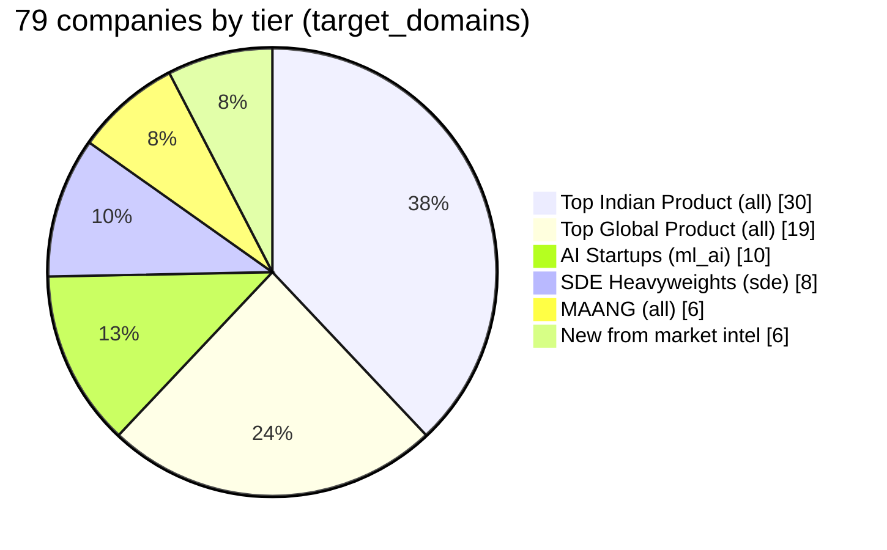

</div>

<br/>

<table>
<tr>
<td valign="top" width="20%" bgcolor="#1a0a0a">

 &nbsp;`6`

Google · Microsoft
Amazon · Meta
Apple · Netflix

`target_domains: all`

</td>
<td valign="top" width="22%" bgcolor="#0d1530">

 &nbsp;`19`

Uber · Stripe · Adobe · Atlassian
Salesforce · Intuit · NVIDIA · AMD
Qualcomm · PayPal · Databricks
Airbnb · LinkedIn · Coinbase
Wayfair · Target · Hotstar
Zoho · Walmart GTC

</td>
<td valign="top" width="26%" bgcolor="#08180a">

 &nbsp;`30`

Flipkart · Zepto · Swiggy · Meesho
Razorpay · PhonePe · CRED · Dream11
Groww · Juspay · Browserstack
Freshworks · Postman · InMobi · Ola
Zomato · Myntra · MakeMyTrip
Delhivery · upGrad · BharatPe
Tata 1mg · Physics Wallah
Urban Company · Rapido · Lenskart
Porter · ixigo · OYO · MPL

</td>
<td valign="top" width="16%" bgcolor="#130c26">

 &nbsp;`10`

Sarvam AI · Krutrim AI
Uniphore · Yellow.ai
Observe.AI · Vue.ai
Sprinklr · Darwinbox
Auric AI Labs · Haptik

`target_domains: ml_ai`

</td>
<td valign="top" width="16%" bgcolor="#101a26">

 &nbsp;`8`

Cisco · NetApp
Nutanix · Cohesity
Rubrik · Palo Alto
ServiceNow · Datadog

`target_domains: sde`

</td>
</tr>
</table>

<br/>

> Companies that can't be scraped (LinkedIn API returning 0, unresolvable slugs, etc.) are tracked in `profile/exception_companies.json` with the exact failure category.

<p align="right">(<a href="#readme-top">back to top</a>)</p>

---

## ✦ Profile configuration

`profile/{user}/profile.json` is the single source of truth per user. Every agent reads from it at runtime — nothing is hardcoded. To onboard a new user via CLI: `python scripts/export_questionnaire.py --user <name>`, fill it, then run the persona builder. Via web: sign up → onboarding wizard does the same end-to-end.

<br/>

**Web wizard — 5 steps** (`frontend/app/(app)/onboarding/page.tsx`)

<div align="center">

| 1️⃣ Upload | 2️⃣ Targets | 3️⃣ Quiz | 4️⃣ Review | 5️⃣ Synthesis |
|:---:|:---:|:---:|:---:|:---:|
| Resume + LinkedIn PDFs | role, salary, location | 13-Q chat | edit fields | LLM merge (SSE-tracked) |
| `react-dropzone` 10MB | `react-hook-form` + zod | `gpt-5.4-mini` | `PATCH /persona` | `gpt-5` synthesis |
| `POST /persona/upload-pdf` | `POST /persona/questionnaire` | `POST /persona/quiz-answers` | inline | `POST /persona/finalize` |
|  |  |  |  |  |

</div>

The `(app)/layout.tsx` checks `account.has_profile` on every render. No profile + active status → middleware injects `x-pathname` header → layout redirects to `/onboarding`. Cannot bypass via direct URL.

```json
{
  "identity": {
    "name": "Your Name",
    "short_title": "AI Engineer",
    "full_time_months": 11,
    "intern_months": 9,
    "notice_period_months": 2,
    "location": "Bengaluru",
    "open_to_relocation": true,
    "relocation_cities": ["Hyderabad", "Pune"]
  },
  "target": {
    "roles": ["MLE-1", "AI Engineer", "Data Scientist"],
    "role_domain": "ml_ai",
    "search_terms": ["Machine Learning Engineer", "LLM Engineer", "..."],
    "watchlist_title_keywords": ["machine learning", "data scientist", "llm", "..."],
    "min_salary_lpa": 25,
    "target_by": "2027-01-01",
    "preferred_work_style": "hybrid"
  },
  "skills": [
    {
      "skill": "LLM Pipeline Engineering",
      "depth": "can_architect",
      "market_aliases": ["LLM pipelines", "agentic AI", "GenAI systems"]
    }
  ],
  "certifications": ["Google Cloud ML Engineer", "..."],
  "publications": [],
  "key_projects": [{ "name": "Bodhi Atomize", "summary": "..." }],
  "known_gaps": ["LLM fine-tuning", "Distributed training"]
}
```

<br/>

**Active users (May 2026):**

| User | `role_domain` | full_time + intern (months) | Notes |
|---|---|---|---|
| shivang | ml_ai | 11 + 9 | Owner. Publicis Sapient → DS-1/MLE-1 |
| krishna | ml_ai | 16 + 18 | 2 publications (IEEE + Springer) |
| anushthan | sde | 11 + 6 | SDE persona — drove watchlist domain split |
| sambhav | tbd | tbd | Onboarding pending |

**Depth levels** tell the gap agent how much to infer: `can_teach` (deep) → `can_architect` (production) → `can_use` (working). High depth in a domain implies the core framework (architect-level CV implies PyTorch).

<br/>

**Schema v2 at a glance** — visualised as a mindmap (`agents/persona_builder.py`)

<div align="center">

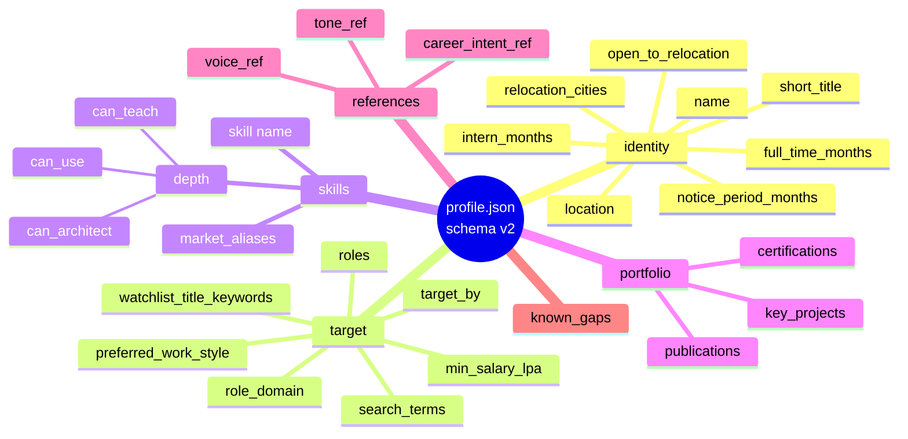

</div>

<p align="right">(<a href="#readme-top">back to top</a>)</p>

---

## ✦ LLM strategy

Cost matched to task complexity. High-volume tasks use the cheapest reliable model. One-off quality tasks use better models. LaTeX work always goes to Claude. All calls route through `sdk/dossier_sdk/core/llm_client.py` — no agent imports `openai` or `anthropic` directly.

<br/>

<table>
<thead>
<tr><th align="left">Task</th><th align="left">Model</th><th align="center">Tier</th><th align="left">Reason</th></tr>
</thead>
<tbody>
<tr>
<td>Job scoring</td><td><code>gpt-5.4-mini</code></td>
<td align="center" bgcolor="#0a1e0a"></td>
<td>Runs on every job — cost is the only constraint</td>
</tr>
<tr>
<td>Skill extraction (gap)</td><td><code>gpt-5.4-mini</code></td>
<td align="center" bgcolor="#0a1e0a"></td>
<td>Batch across 200+ JDs</td>
</tr>
<tr>
<td>Company intel synthesis</td><td><code>gpt-5.4-mini</code></td>
<td align="center" bgcolor="#0a1e0a"></td>
<td>Noisy scraped data needs reasoning</td>
</tr>
<tr>
<td>Market intel extraction</td><td><code>gpt-5.4-mini</code></td>
<td align="center" bgcolor="#0a1e0a"></td>
<td>Structured JSON from news snippets</td>
</tr>
<tr>
<td>Cold message drafting</td><td><code>gpt-5.4-mini</code></td>
<td align="center" bgcolor="#0a1e0a"></td>
<td>Prompt-driven quality; gpt-5 caused silent empty outputs</td>
</tr>
<tr>
<td>Persona builder synthesis</td><td><code>gpt-5</code></td>
<td align="center" bgcolor="#0d1530"></td>
<td>Conversational depth + identity clash resolution rules</td>
</tr>
<tr>
<td>Cover letter</td><td><code>claude-haiku-4-5</code></td>
<td align="center" bgcolor="#1a1000"></td>
<td>Good writing, cost-efficient</td>
</tr>
<tr>
<td>Resume bullets (LaTeX)</td><td><code>claude-sonnet-4-6</code></td>
<td align="center" bgcolor="#1a1000"></td>
<td>LaTeX-aware, highest precision</td>
</tr>
</tbody>
</table>

All model names live in `sdk/dossier_sdk/config.py` only — changing any model is a one-line edit.

**Cost reference:** `gpt-5.4-mini` at $0.75/M input. A full week of daily discovery + watchlist ≈ **$0.30**. Gap analysis is **$0.73 one-time**, then incremental. Company intel ≈ **$0.02/job** with 7-day Tavily cache.

<p align="right">(<a href="#readme-top">back to top</a>)</p>

---

## ✦ Roadmap

The CLI pipeline is feature-complete. The roadmap now tracks the SaaS wrap — milestones M0–M11.

<br/>

<div align="center">

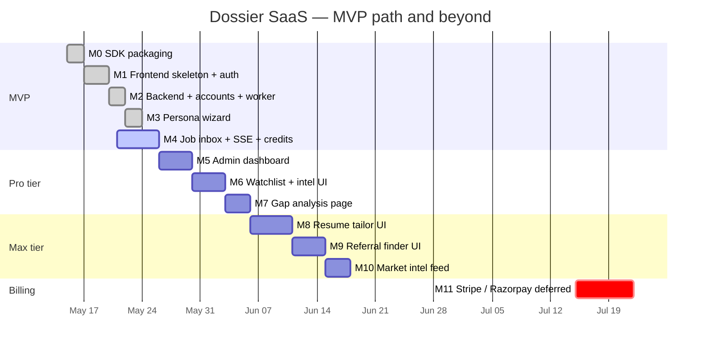

</div>

<br/>

<table>
<thead><tr><th align="left">Milestone</th><th align="left">Scope</th><th align="center">Status</th></tr></thead>
<tbody>
<tr><td><strong>M0</strong></td><td>Repo restructure · <code>dossier-sdk</code> packaging · backend/frontend skeletons</td><td align="center" bgcolor="#08180a"></td></tr>
<tr><td><strong>M1</strong></td><td>Next.js 16 frontend · Clerk auth · warm-mocha theme · marketing + pricing + dashboard shell</td><td align="center" bgcolor="#08180a"></td></tr>
<tr><td><strong>M2</strong></td><td>FastAPI backend · <code>accounts.db</code> · Clerk webhook · <code>/me</code> · worker boilerplate · frontend wiring</td><td align="center" bgcolor="#08180a"></td></tr>
<tr><td><strong>M3</strong></td><td>Persona wizard (5 steps: upload → targets → quiz → review → synthesis) · onboarding gate · 13-question quiz · finalize endpoint</td><td align="center" bgcolor="#08180a"></td></tr>
<tr><td><strong>M4</strong></td><td>Job inbox · <code>POST /pipeline/run</code> · credit gate · SSE progress · worker discovery handler · refund-on-failure</td><td align="center" bgcolor="#14102e"></td></tr>
<tr><td><strong>M5</strong></td><td>Admin dashboard — approve pending, change tier/credits, edit <code>target_companies.json</code></td><td align="center" bgcolor="#0d1530"></td></tr>
<tr><td><strong>M6</strong></td><td>Watchlist + company intel UI (Pro tier unlock)</td><td align="center" bgcolor="#0d1530"></td></tr>
<tr><td><strong>M7</strong></td><td><code>/gaps</code> page — skill frequency vs profile (Pro)</td><td align="center" bgcolor="#0d1530"></td></tr>
<tr><td><strong>M8</strong></td><td>Resume tailor + cover letter UI (Max)</td><td align="center" bgcolor="#0d1530"></td></tr>
<tr><td><strong>M9</strong></td><td>Referral finder + cold message UI (Max)</td><td align="center" bgcolor="#0d1530"></td></tr>
<tr><td><strong>M10</strong></td><td>Market intel feed (Max)</td><td align="center" bgcolor="#0d1530"></td></tr>
<tr><td><strong>M11</strong></td><td>Stripe / Razorpay — deferred until ≥20 Pro waitlist signups</td><td align="center" bgcolor="#14101e"></td></tr>
</tbody>
</table>

<br/>

> **MVP = M0–M4.** After M4 ships, the legacy `dashboard.py` Streamlit tracker retires. Dogfood for ≥1 week, then continue M5+.

<br/>

<details>
<summary><strong>Milestone timeline (Mermaid)</strong></summary>

<br/>

<div align="center">

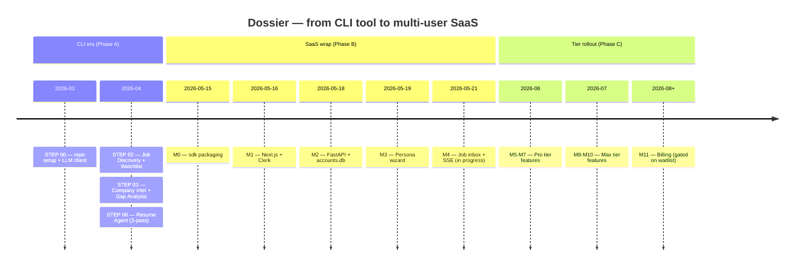

</div>

</details>

<br/>

<details>
<summary><strong>Cost-per-run trajectory (Mermaid xy-chart)</strong></summary>

<br/>

<div align="center">

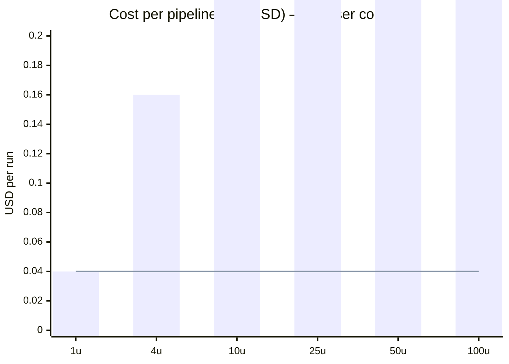

<sub>Bar: total fleet cost · Line: cost per user (constant — agents parallelise by user not by query)</sub>

</div>

</details>

<p align="right">(<a href="#readme-top">back to top</a>)</p>

---

## ✦ Frontend route map

Next.js 16 App Router · 3 route groups · auth gate via Clerk middleware + onboarding gate via `x-pathname` header.

<div align="center">

```mermaid
mindmap
  root((app/))
    "(marketing)"
      layout.tsx
      page.tsx --- "/"
      pricing
    "(auth)"
      layout.tsx
      sign-in
        "[[...sign-in]]"
      sign-up
        "[[...sign-up]]"
    "(app) 🔒 Clerk-gated"
      layout.tsx --- "/me + redirect gate"
      pending --- "awaiting admin"
      onboarding --- "5-step wizard"
      dashboard --- "welcome + 3 cards"
      jobs --- "🚧 M4 inbox"
      watchlist --- "🚧 M6 Pro"
      gaps --- "🚧 M7 Pro"
      resume --- "🚧 M8 Max"
      referrals --- "🚧 M9 Max"
      market --- "🚧 M10 Max"
      admin --- "🚧 M5"
    layout.tsx --- "ClerkProvider + fonts"
    globals.css --- "Tailwind v4 tokens"
```

</div>

<p align="right">(<a href="#readme-top">back to top</a>)</p>

---

## ✦ Project structure

```
dossier/
│
├── run_dossier.py                       thin CLI · delegates to dossier_sdk.orchestrator
├── dashboard.py                         legacy Streamlit tracker (retires after M4)
├── pyproject.toml                       root project · depends on dossier-sdk
│
├── sdk/                                 ★ installable: pip install -e ./sdk
│   ├── pyproject.toml                   dossier-sdk 1.0.1
│   ├── dossier_sdk/
│   │   ├── config.py                    singleton config · model name constants
│   │   ├── orchestrator.py              run_pipeline() · RunResult dataclass
│   │   ├── agents/                      job_discovery · watchlist_agent · company_intel
│   │   │                                gap_analysis · referral_finder · resume_agent
│   │   │                                persona_builder · market_intel_agent
│   │   ├── core/                        llm_client · linkedin_scraper · file_vault
│   │   │                                db · intel_cache · utils · logger
│   │   └── prompts/                     job_scoring · skill_extract · resume_tailor
│   │                                    resume_critique · resume_revise · cover_letter
│   └── tests/
│
├── backend/                             ★ FastAPI service on :8000
│   ├── pyproject.toml                   dossier-api · depends on dossier-sdk (editable)
│   ├── src/dossier_api/
│   │   ├── main.py                      app factory · lifespan(init_db) · CORS
│   │   ├── settings.py                  env loader singleton
│   │   ├── db.py                        accounts.db schema + helpers
│   │   ├── deps.py                      get_current_user · require_admin (Clerk JWT)
│   │   ├── models/                      account · persona · pipeline · jobs (Pydantic)
│   │   ├── routers/                     health · me · webhooks · persona · pipeline · jobs
│   │   ├── services/                    credit_gate · persona_service · jobs_service
│   │   └── workers/                     pipeline_worker (polling loop, dispatch table)
│   ├── scripts/seed_existing_users.py   idempotent Clerk + accounts.db seeder
│   └── tests/                           37+ pytest tests
│
├── frontend/                            ★ Next.js 16 web app on :3000
│   ├── package.json                     next 16.2.6 · react 19.2.4 · tailwind v4 · clerk
│   ├── app/
│   │   ├── (marketing)/                 hero · terminal-log · agents-grid · pricing · final-cta
│   │   ├── (auth)/sign-in · sign-up/    Clerk catch-all routes
│   │   ├── (app)/
│   │   │   ├── layout.tsx               app shell · /me fetch · onboarding gate
│   │   │   ├── dashboard/page.tsx       welcome + 3-card dashboard
│   │   │   ├── onboarding/page.tsx      5-step persona wizard host
│   │   │   └── pending/page.tsx         account awaiting admin approval
│   │   └── layout.tsx                   ClerkProvider · fonts · theme
│   ├── components/
│   │   ├── ui/                          shadcn primitives (button, card, tabs, ...)
│   │   ├── brand/                       Mark · Wordmark · Lockup
│   │   ├── dossier/                     CreditPill · Sidebar · JobCard (M4)
│   │   ├── marketing/                   hero · agents · pricing-teaser
│   │   └── motion/                      Reveal · CountUp helpers
│   ├── lib/
│   │   ├── api.ts · server-api.ts       typed FastAPI client (RSC + client variants)
│   │   ├── api/                         persona · jobs · pipeline modules
│   │   ├── persona-schema.ts            zod schema mirroring SDK
│   │   └── query-client.tsx             TanStack Query provider
│   ├── middleware.ts                    Clerk auth + x-pathname for onboarding gate
│   └── tests/                           Vitest unit tests
│
├── profile/
│   ├── {user}/profile.json              per-user persona — source of truth (gitignored)
│   ├── {user}/raw/                      resume.pdf + linkedin.pdf drop zone
│   ├── target_companies.json            79 companies · tier · slug · ATS · target_domains
│   ├── exception_companies.json         unscrapable companies + failure category
│   └── auth.json                        legacy Streamlit dashboard passwords (gitignored)
│
├── scripts/                             CLI wrappers importing from dossier_sdk
│   ├── run_job_discovery.py             --user --hours --min-score
│   ├── run_watchlist.py                 --user --min-score --location
│   ├── run_company_intel.py             --user --min-score --source
│   ├── run_gap_analysis.py              --user --force --min-score --top
│   ├── run_market_intel.py              --user
│   ├── run_referral_finder.py           --user --list --job-id --no-csv
│   ├── run_resume_agent.py              --user --list --job-id --version
│   ├── run_persona_builder.py           --user
│   └── export_questionnaire.py          --user <name>
│
├── data/
│   ├── linkedin_company_ids.json        shared cache (all users)
│   └── {user}/
│       ├── dossier.db                   SQLite · seen URLs + job_status (per user)
│       ├── gap_report.json              aggregate skill frequency
│       ├── market_intel_queue.json      audit trail
│       ├── intel_cache/                 per-company Tavily cache (7-day TTL)
│       └── artifacts/{job_id}/
│           ├── jd.txt · score_card.json · intel.json · gap.json
│           ├── referrals.json
│           ├── resume.tex · resume.pdf · cover_letter.txt
│
├── docs/superpowers/
│   ├── specs/2026-05-18-dossier-saas-frontend-design.md     master design spec
│   └── milestones/M0.md ... M11.md                          per-milestone plans
│
├── helper_files/                        PROJECT_OVERVIEW · STEP_00–09 specs
└── tests/                               root pytest suite
```

<p align="right">(<a href="#readme-top">back to top</a>)</p>

---

<div align="center">

<br/>

<!-- Gradient divider -->


<br/><br/>

## ✦ Repository pulse

<table>
<tr>
<td valign="top" width="50%">

**Star history**

<a href="https://star-history.com/#shivangsingh26/dossier&Date">
  
</a>

</td>
<td valign="top" width="50%">

**Commit activity**

<a href="https://github.com/shivangsingh26/dossier/pulse">
  
</a>

</td>
</tr>
</table>

<br/>

**Contributors**

<a href="https://github.com/shivangsingh26/dossier/graphs/contributors">
  
</a>

<br/><br/>

<!-- Gradient divider -->


<br/><br/>

<strong>Built for engineers who want to work at places worth working at.</strong>

<br/><br/>

[](https://github.com/shivangsingh26/dossier)
[](https://github.com/shivangsingh26/dossier/fork)
[](https://github.com/shivangsingh26/dossier/issues)

<br/>

<!-- Animated waving footer -->


<br/>

<sub>Made with care by <a href="https://github.com/shivangsingh26">@shivangsingh26</a> · Powered by <code>uv</code> · <code>FastAPI</code> · <code>Next.js 16</code> · <code>Clerk</code> · <code>OpenAI</code> · <code>Anthropic</code></sub>

<br/>

</div>
